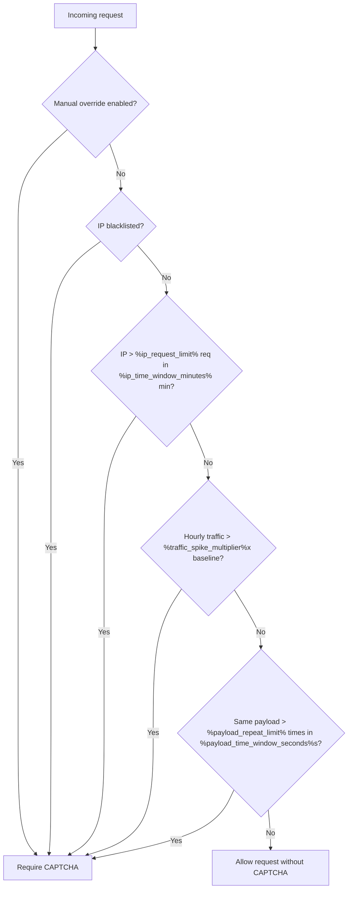

# CAPTCHA Decisioning Overview

<link-summary>Explains when CAPTCHA is shown, why each trigger exists, and how decisions are made.</link-summary>
<card-summary>Understand the five adaptive CAPTCHA triggers without reading backend code.</card-summary>
<web-summary>Reference article for non-developer specialists who need to explain or validate CAPTCHA behavior.</web-summary>

<primary-label ref="audience-nondev"/>
<secondary-label ref="security"/>
<secondary-label ref="stable"/>

%product% protects services from abusive traffic while reducing unnecessary friction for normal users.
Instead of showing a challenge on every interaction, the service evaluates requests against a small set of rules.

<include from="lib.md" element-id="captcha-thresholds-snippet"/>

## Scope and definitions

- **Protected scope:** the rules apply only to endpoints/operations marked as *protected*.
- **Client IP used for rules:** the **effective client IP** as seen by the service (after CDN / reverse proxy / load balancer).
- **Time basis:** time windows (20 minutes, 30 seconds) and **hour buckets** are evaluated using one reference timezone (typically UTC).

<note>

If you need to explain or troubleshoot a spike in challenges, see <a href="CAPTCHA-Operations-Runbook.md">CAPTCHA Operations &amp; Troubleshooting</a>.

</note>

## Why adaptive CAPTCHA is used
<secondary-label ref="impact"/>

Always-on CAPTCHA interrupts legitimate users and can reduce retention.
Adaptive CAPTCHA challenges only when the request pattern looks risky, such as:

- Bursts from one source.
- Requests from known-bad IP addresses.
- Sudden traffic anomalies.
- Repeated identical payloads.
- Manual enforcement during incidents.

## When CAPTCHA is required

| Rule | Trigger condition | Typical legitimate causes (false positives) | Effect |
|---|---|---|---|
| High request rate from one IP | More than `%ip_request_limit%` requests from the same IP in less than `%ip_time_window_minutes%` minutes | Many users behind one network (NAT), corporate proxy, partner integration | CAPTCHA is required for requests from that IP |
| IP in blacklist | Request IP exists in `%blacklist_source%` | Reused IP address, VPN / proxy exit nodes used by legitimate users | CAPTCHA is required immediately |
| Hourly traffic spike | Current hour receives more than `%traffic_spike_multiplier%x` average hourly requests over the last `%traffic_baseline_period_days%` days | Marketing campaign, scheduled batch jobs, retry storms during an outage | CAPTCHA is enabled for the current hour bucket |
| Repeated payload pattern | Same payload sent more than `%payload_repeat_limit%` times in `%payload_time_window_seconds%` seconds | Client retries, automation calling the same operation repeatedly | CAPTCHA is required for matching traffic |
| Manual override | Admin enables CAPTCHA for selected request scopes | Incident response or preventive hardening | CAPTCHA is required for the configured scope |

## Decision priority

If multiple rules match the same request, the service evaluates in this order:

1. Manual override
2. IP blacklist
3. IP burst threshold
4. Hourly traffic spike
5. Repeated payload pattern

## Decision flow

## What users see

When a request is challenged, the API typically returns a response indicating that a CAPTCHA must be completed before continuing.
The frontend (or client) should display a CAPTCHA and resubmit the request after the user passes the challenge.

Typical challenge response:

<code-block lang="json" src="../codeSnippets/responses/captcha-challenge-response.json"/>

## How to investigate a report

Ask for (or collect) the following information:

- **Timestamp** and timezone (or specify UTC).
- **Request ID / trace ID** (if available).
- **Endpoint / operation** the user tried to run.
- **Effective client IP** (if you have access to edge logs).
- **How many times** the user tried and whether they used a VPN / proxy.
- **Screenshot** of the challenge (if applicable).

Then follow the runbook to identify the trigger in rule-evaluation logs and choose the right action.

Repeated payload request (example):

<code-block lang="json" src="../codeSnippets/requests/repeated-payload-request.json"/>

## What is intentionally not covered

- Backend implementation details and source code logic.
- CAPTCHA vendor internals.
- Final customer messaging copy.

<seealso style="cards" title="Next">
    <category ref="operations">
        <a href="CAPTCHA-Operations-Runbook.md" summary="Triage steps, trigger-to-action mapping, and escalation."/>
        <a href="CAPTCHA-Glossary.md" summary="Definitions for key terms used in this doc set."/>
    </category>
</seealso>
